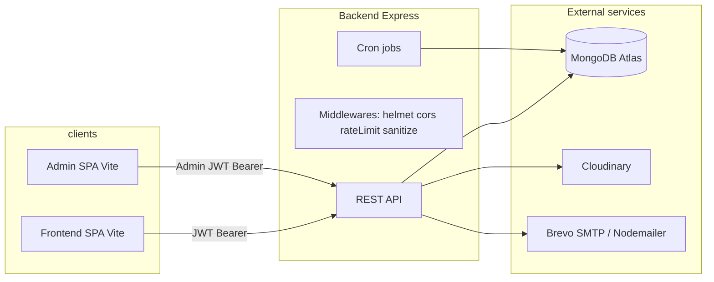

# BuildEstate / Real-Estate-Website — Project Description for LLMs

This document describes the **BuildEstate** real estate platform as implemented in this repository: product intent, **design language**, **monorepo layout**, **tech stack**, **backend architecture**, **APIs**, **data models**, **auth**, **integrations**, and **operational conventions**. It is written so another model can onboard without reading every file first.

---

## 1. Product summary

**BuildEstate** is a full-stack real estate web application:

- **Public marketing site + property discovery** (`frontend/`): home, property catalog, property detail, about, contact, user sign-in/up, password reset, email verification, **user-submitted listings** (“add property”), **my listings**, **my maintenance requests**, and a **maintenance staff dashboard** (role-gated).
- **Admin dashboard** (`admin/`): login, dashboard stats, CRUD-style property management (list/add/update), **appointment management**, **pending user listings** (approve/reject), **user management** (suspend/ban/delete, bulk actions), **maintenance request assignment**, **maintenance role promotion/demotion**, **activity logs**, exports.
- **REST API** (`backend/`): Express.js on Node.js, MongoDB via Mongoose, JWT auth for users/admins/maintenance staff, file uploads (Multer → temp disk → **Cloudinary**), transactional email via **Nodemailer** (typically **Brevo SMTP**), scheduled jobs for listing expiry and auto-unsuspension, and **maintenance workflow APIs**.

**Intentionally not present:** Earlier versions referenced an “AI Property Hub” (external scraping / LLM search). That feature has been **removed** from routes, services, and the public SPA; documentation here reflects the **current** codebase only.

---

## 2. Repository structure (monorepo)

| Path | Role |
|------|------|
| `frontend/` | React 18 + TypeScript + Vite — customer-facing SPA |
| `admin/` | React 18 + JSX + Vite — admin SPA |
| `backend/` | Express API — single service entry `server.js` |
| `shared/` | Minimal shared TypeScript utilities (e.g. `formatPrice`) intended for reuse across packages |

There is **no** workspace tooling (npm workspaces / Turborepo) in `package.json` at repo root in the typical layout; each app installs dependencies independently.

---

## 3. Tech stack

### 3.1 Frontend (`frontend/package.json`)

| Layer | Technology |
|-------|------------|
| UI library | React **18.3** |
| Language | **TypeScript** |
| Build / dev | **Vite 6** (`@vitejs/plugin-react`) |
| Styling | **Tailwind CSS 4** via `@tailwindcss/vite` |
| Routing | **react-router-dom 7** |
| HTTP | **axios** |
| Motion | **framer-motion**, **motion** |
| Icons | **lucide-react**, Google **Material Icons** (fonts in CSS) |
| Toasts | **sonner** |
| Charts (where used) | **recharts** |
| UI primitives | **Radix UI** (`@radix-ui/react-*`), **class-variance-authority**, **clsx**, **tailwind-merge** |
| Carousel / date UI | **embla-carousel-react**, **react-day-picker** |
| Env | **dotenv** (if used in tooling; primary env prefix for client is `VITE_*`) |

**Bundling note:** `vite.config.ts` defines `manualChunks` for react, framer-motion, and UI bundles.

### 3.2 Admin (`admin/package.json`)

| Layer | Technology |
|-------|------------|
| UI library | React **18.3** |
| Language | **JSX** (not strict TypeScript in main app) |
| Build / dev | **Vite 6** |
| Styling | **Tailwind CSS 3** + PostCSS + Autoprefixer |
| Routing | **react-router-dom 7** |
| HTTP | **axios** |
| Charts | **Chart.js** + **react-chartjs-2** |
| Icons | **lucide-react**, **react-icons**, **@heroicons/react** |
| Motion | **framer-motion** |
| Resilience | **react-error-boundary** |
| Toasts | **sonner** |
| Lint | **ESLint 9** + React plugins |

### 3.3 Backend (`backend/package.json`)

| Layer | Technology |
|-------|------------|
| Runtime | **Node.js** (ES modules: `"type": "module"`) |
| Framework | **Express 4** |
| Database ODM | **Mongoose 8** |
| Auth | **jsonwebtoken**, **bcrypt** / **bcryptjs** |
| Security | **helmet**, **cors**, **express-rate-limit**, **express-mongo-sanitize** |
| Uploads | **multer** (local temp files) |
| Media | **cloudinary** SDK (`v2`) |
| Email | **nodemailer** |
| Compression | **compression** |
| Scheduling | **node-cron** |
| Logging | **winston** |
| Utilities | **validator**, **uuid**, **axios**, **csv-writer** |
| Dev | **nodemon** |

**Scripts:** `npm run dev` → `nodemon server.js`; production may use `server-production.js` (`start:prod`).

---

## 4. Design system (frontend)

### 4.1 Visual identity

- **Brand accent:** terracotta / coral — commonly `#D4755B`, hover `#B86851`.
- **Neutrals:** deep text `#111827`, secondary `#374151`, muted `#4b5563`, borders `#e5e7eb`.
- **Page backgrounds:** warm off-white `#FAF8F4` appears frequently (e.g. 404, loaders).
- **Layout:** marketing sections use generous whitespace, cards with rounded corners and soft shadows; hero typography is large and editorial.

### 4.2 Typography (`frontend/src/styles/fonts.css`)

Google Fonts imports:

| Font | Usage (as commented in repo) |
|------|-------------------------------|
| **Fraunces** | Serif display — hero headings |
| **Syne** | Geometric sans — section titles |
| **Red Hat Display** | Body |
| **Space Mono** | Numeric / price styling where applied |
| **Manrope** | UI / buttons |
| **Material Icons** | Icon font family (`font-material-icons` classes in components) |

Tailwind utilities such as `font-fraunces`, `font-manrope` are used in JSX (configured in Tailwind theme files alongside Tailwind 4 setup).

### 4.3 Imagery

- Many section images were switched to **remote URLs** (e.g. Unsplash) to avoid bundling large local assets and path/colon issues on Windows.
- Property photos are **URLs stored in MongoDB** (admin uploads and user uploads via Cloudinary).

### 4.4 Motion and UX

- **Page transitions:** `AnimatePresence` + route-level wrappers (e.g. `PageTransition`).
- **Lazy-loaded routes** in `frontend/src/App.tsx` for code splitting.
- **ScrollToTop** on navigation.
- **Structured JSON-LD** via `StructuredData` component (`website`, `organization`, `property` types). *Optional consistency note:* some schema copy may still mention “AI”; the live feature set does not include an AI hub.
- **Role-aware navbar actions:** authenticated user and maintenance links are presented via a profile dropdown menu; primary nav structure remains unchanged.

### 4.5 Component architecture

- **Pages** under `frontend/src/pages/`.
- **Feature sections** under `frontend/src/components/<feature>/`.
- **Shared chrome:** `Navbar`, `Footer`, `ScrollToTop`, `StructuredData`.
- **UI kit:** `frontend/src/components/ui/*` — Radix-based primitives (dialog, select, form patterns, etc.), consistent with shadcn-style composition.

---

## 5. Admin UI design

- Uses Tailwind with a similar **warm neutrals + coral accent** vocabulary as the frontend.
- **Sidebar** navigation with collapsible state persisted in `localStorage`.
- **Framer Motion** page transitions; **ErrorBoundary** wraps the app with a custom fallback.
- Toast styling targets **Manrope** to align with marketing UI.

---

## 6. System architecture

- **CORS** is explicit: only listed origins are accepted; development adds default localhost ports (`5173`, `5174`, `4000`). Additional origins can be supplied via `LOCAL_URLS` or `EXTRA_ALLOWED_ORIGINS` (comma-separated). If the admin runs on another port (e.g. `5175`), that origin **must** be added or requests fail with “CORS blocked”.
- **Trust proxy:** enabled appropriately for production (e.g. Render) vs loopback in dev.

---

## 7. Backend composition (`server.js`)

**Order of concerns (simplified):**

1. `dotenv`: `.env.local` in non-production, then `.env` fallback.
2. Global **rate limiter**, **helmet**, **compression**, body parsers (JSON/urlencoded, **500kb** cap).
3. **requestIdMiddleware**, **stats** tracking, **mongoSanitize**.
4. **CORS** with whitelist logic.
5. `connectdb()` — Mongo connection; on success starts cron jobs (`expireListings`, `autoUnsuspend`).
6. Routers mounted under `/api/...` (see §9).
7. Global error handler returning JSON with `requestId`.
8. `/health`, `/status`, `/` HTML status page (`serverweb.js`).
9. 404 handler.

**Security-related middleware highlights:**

- **Helmet** CSP in production (relaxed/disabled aspects in dev).
- **express-mongo-sanitize** logs suspicious keys via **winston** logger.
- Dedicated limiters in `middleware/rateLimitMiddleware.js` for auth-sensitive routes (login/register); development may use higher limits than production for ergonomics.

---

## 8. Data models (Mongoose)

| Model file | Purpose |
|------------|---------|
| `userModel.js` | End users: credentials, email verification, reset tokens, **status** (`active` / `suspended` / `banned`), moderation metadata, indexes for admin queries |
| `userModel.js` (export) | **Admin** sub-schema `Admin` — separate collection for admin users with bcrypt hashing on save |
| `propertyModel.js` | Listings: core fields + **status workflow** (`pending`, `active`, `rejected`, `expired`), `postedBy` ref to User, `rejectionReason`, `expiresAt`, timestamps |
| `maintenanceRequestModel.js` | Maintenance workflow tickets: issue title/description, priority, `status` (`open`, `assigned`, `in_progress`, `completed`, `cancelled`), assignment fields (`assignedTo`, `assignedBy`, `assignedAt`), completion details (`completionNotes`, `completionCost`, `completedAt`), references to `property` and `requestedBy` |
| `appointmentModel.js` | Property viewing appointments |
| `formModel.js` | Contact form submissions |
| `newsModel.js` | News/content for site |
| `statsModel.js` | API / usage statistics persistence |
| `adminActivityLogModel.js` | Audit trail for admin actions |

**Important domain rule:** Public listing endpoints filter to **`status: 'active'`** or legacy documents **without** `status`, so pending user listings never appear on the marketing site until approved.

---

## 9. HTTP API surface

Base URL examples:

- Local backend: `http://localhost:4000`
- API routes are rooted at **`/api`** for JSON endpoints (frontend axios uses `${VITE_API_BASE_URL}/api`).

### 9.1 Properties — “products” router (legacy path name)

Mounted at **`/api/products`** (`routes/productRoutes.js` → `productController.js`):

| Method | Path | Role |
|--------|------|------|
| GET | `/api/products/list` | Paginated **public** listings (`property` array + pagination meta). Uses Mongoose `Property`. |
| GET | `/api/products/single/:id` | Single listing |
| POST | `/api/products/add` | Admin-panel style add (multipart fields `image1`…`image4`) |
| POST | `/api/products/update` | Update with optional images |
| POST | `/api/products/remove` | Remove |

**LLM note:** The frontend names this “properties” but the URL segment is **`products`**.

### 9.2 User-submitted listings

Mounted under **`/api`** (`routes/propertyRoutes.js` → `propertyController.js`), **JWT `protect`**, multipart:

| Method | Path | Role |
|--------|------|------|
| POST | `/api/user/properties` | Create listing → **`pending`**, **Cloudinary** upload, **45-day** `expiresAt` |
| GET | `/api/user/properties` | Owner’s listings + pagination |
| PUT | `/api/user/properties/:id` | Update |
| DELETE | `/api/user/properties/:id` | Delete |

### 9.3 Users (`/api/users`)

Registration, login, profile, forgot/reset password, email verification — implemented in `routes/userRoutes.js` + controllers (JWT secret from `JWT_SECRET`).

**Frontend mapping:** `userAPI.register` sends `{ name, email, password }` (maps `fullName` → `name`).

`User.role` supports at least:

- `user` (default)
- `maintenance` (staff, assigned by admin action)

### 9.4 Maintenance (`/api/maintenance`)

Workflow ownership:

- Property owner creates request (`open`)
- Admin assigns to maintenance staff (`assigned`)
- Assigned staff moves to `in_progress`, then `completed`

| Method | Path | Access | Purpose |
|--------|------|--------|---------|
| POST | `/api/maintenance` | `protect` (user) | Create maintenance request for own property |
| GET | `/api/maintenance/my` | `protect` (user) | List current user’s maintenance requests |
| GET | `/api/maintenance/my/:id` | `protect` (user) | Get single own request |
| GET | `/api/maintenance/all` | `adminProtect` | Admin list of all requests |
| GET | `/api/maintenance/staff` | `adminProtect` | List active maintenance staff for assignment |
| PUT | `/api/maintenance/:id/assign` | `adminProtect` | Assign request to maintenance staff |
| GET | `/api/maintenance/assigned` | `protect` + `requireMaintenanceStaff` | Staff list of assigned requests |
| PUT | `/api/maintenance/:id/status` | `protect` + `requireMaintenanceStaff` | Assigned staff updates request status |

### 9.5 Forms (`/api/forms`)

Contact submissions (`contactAPI.submit` → `/api/forms/submit`).

### 9.6 News (`/api/news`)

CMS-style news endpoints for content consumption.

### 9.7 Appointments (`/api/appointments`)

Schedule/cancel/list flows; supports guest and authenticated contexts depending on handler (see `appointmentRoutes.js`).

### 9.8 Admin (`/api/admin`)

All routes guarded by **`adminProtect`**:

- JWT must decode to payload where **`email === process.env.ADMIN_EMAIL`** (admin tokens are distinct from user tokens in practice).
- Capabilities: stats, appointments, pending properties approve/reject, full user moderation, **role management** (`PUT /api/admin/users/:id/role` for `user`/`maintenance`), bulk operations, activity logs + CSV export, enhanced analytics endpoints, circuit breaker snapshot route.

### 9.9 Health

- `/health/*` router for probes.
- `/status` JSON diagnostics.

---

## 10. Authentication model

### 10.1 End users

- **Bearer token** stored in frontend `localStorage` under key **`buildestate_token`**.
- Axios interceptor attaches `Authorization: Bearer <token>`.
- On **401**, token is removed (optional redirect to sign-in is commented out).
- JWT for user login includes a `role` claim; frontend stores user object (`buildestate_user`) and branches UX by role.

### 10.1.1 Maintenance staff

- Maintenance staff are users in the same `User` collection with `role: "maintenance"`.
- Access enforcement for staff endpoints uses `requireMaintenanceStaff` middleware after `protect`.
- Frontend routes:
  - `/maintenance-dashboard` for maintenance users
  - `/my-maintenance` for regular users submitting/viewing requests

### 10.2 Admins

- Separate login flow in admin app; still JWT-based but validated in `adminProtect` against **`ADMIN_EMAIL`** env var.
- Admin record created via **`backend/scripts/createAdmin.js`** (uses `ADMIN_EMAIL` / `ADMIN_PASSWORD` — password hashing aligns with Admin model).

---

## 11. Media pipeline (Cloudinary)

- Config: `backend/config/cloudinary.js`.
- **`uploadLocalImage(filePath, folder)`** uploads from Multer’s temp path, returns **`secure_url`**.
- **Graceful degradation:** If env vars are missing or placeholder-like, `cloudinaryConfigured` is false — server logs a warning and upload handlers throw a **clear configuration error** rather than crashing at import time.
- **Folders:** uploads default to Cloudinary folder **`Property`**.

**Environment variables:** `CLOUDINARY_CLOUD_NAME`, `CLOUDINARY_API_KEY`, `CLOUDINARY_API_SECRET` (see `backend/.env.example`).

---

## 12. Email

- `backend/email.js` configures **Nodemailer** transport using **`SMTP_USER`**, **`SMTP_PASS`**, host/settings compatible with **Brevo** (Sendinblue).
- **`EMAIL`** / **`EMAIL_USER`** identify the sender; **`BREVO_API_KEY`** may be used where API-style calls exist elsewhere — SMTP remains the primary path for transactional mail.

---

## 13. Background jobs

| Job | Purpose |
|-----|---------|
| `utils/expireListings.js` | Marks listings expired past `expiresAt` |
| `utils/autoUnsuspend.js` | Lifts **suspended** users when `suspendedUntil` passes |

Started after successful DB connection in `server.js`.

---

## 14. Frontend ↔ backend integration

- **Env:** `frontend`: `VITE_API_BASE_URL` (no trailing `/api` — code appends `/api`).
- **Env:** `admin`: typically `VITE_BACKEND_URL` pointing to backend origin (pattern mirrors frontend).
- **Typical dev ports:** frontend `5173`, admin `5174`, backend `4000` — align with CORS env vars.
- Frontend API client exports `maintenanceAPI` with methods for create/list/update status.
- Navbar action model:
  - Regular authenticated users: `+ List Property` visible; account actions (`My Listings`, `My Maintenance`, `Logout`) in profile dropdown.
  - Maintenance users: account actions (`Maintenance Dashboard`, `Logout`) in profile dropdown.

### Response-shape quirks LLMs should respect

- **`GET /api/products/list`** returns `{ success: true, property: [...], pagination: {...} }` — note **`property`** (singular key) holding an **array**.
- **`GET /api/user/properties`** returns `{ success: true, properties: [...], pagination: {...} }`.
- Frontend listing pages should accept both shapes defensively if refactoring (`property` vs `properties`).

---

## 15. Deployment assumptions (from project conventions)

- **Frontend:** often deployed to **Vercel** (`frontend/vercel.json` may define SPA rewrites).
- **Admin:** separate **Vercel** deployment.
- **Backend:** commonly **Render** or similar Node host; `trust proxy` set for production.
- **MongoDB Atlas** for hosted database.

Exact infra varies by operator; env vars drive behavior.

---

## 16. SEO and static assets

- `frontend/public/robots.txt`, `sitemap.xml` — marketing crawl hints.
- Images and favicon under `public/` as usual for Vite.

---

## 17. Testing and quality

- Backend `npm test` is a **placeholder** (`echo 'No tests specified'`).
- No unified e2e suite referenced in package scripts; verification is primarily manual.

---

## 18. Conventions for agents editing this repo

1. **Do not resurrect `/api/products` naming** without updating **both** admin and frontend axios paths — it is entrenched.
2. **CORS:** When changing Vite ports, update **`LOCAL_URLS`** / **`EXTRA_ALLOWED_ORIGINS`** on backend **before** assuming bugs.
3. **Public listings:** Always respect **`status`** filtering (`active` or legacy missing status).
4. **Upload size:** Keepwithin Multer limits and Express body limits (currently conservative — **500kb** JSON).
5. **Shared code:** `shared/` is small; prefer **not** to duplicate `formatPrice` logic across apps.
6. **Docs drift:** Files like `ARCHITECTURE_ISSUES.md` may describe historical AI/cache artifacts — trust **`routes/`**, **`server.js`**, and **`package.json`** as source of truth.

---

## 19. Quick file map for onboarding

| Concern | Location |
|---------|----------|
| Backend entry | `backend/server.js` |
| Public property API | `backend/routes/productRoutes.js`, `backend/controller/productController.js` |
| User listings API | `backend/routes/propertyRoutes.js`, `backend/controller/propertyController.js` |
| Maintenance API | `backend/routes/maintenanceRoutes.js`, `backend/controller/maintenanceController.js` |
| Admin API | `backend/routes/adminRoutes.js`, `backend/controller/adminController.js` |
| Auth middleware | `backend/middleware/authMiddleware.js` |
| Mongoose models | `backend/models/*.js` |
| Frontend routes | `frontend/src/App.tsx` |
| Frontend API client | `frontend/src/services/api.ts` |
| Frontend maintenance pages | `frontend/src/pages/MyMaintenanceRequestsPage.tsx`, `frontend/src/pages/MaintenanceDashboardPage.tsx` |
| Frontend navbar dropdown logic | `frontend/src/components/common/Navbar.tsx` |
| Admin routes | `admin/src/App.jsx` |
| Admin maintenance page | `admin/src/pages/Maintenance.jsx` |
| Cloudinary | `backend/config/cloudinary.js` |
| Env template | `backend/.env.example` |

---

*Generated from repository analysis. When behavior conflicts with this document, the code wins.*
